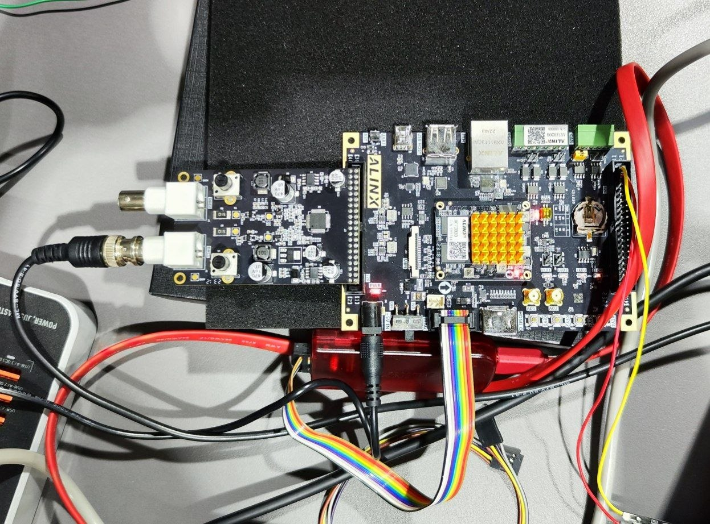
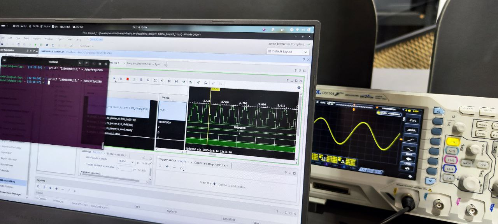
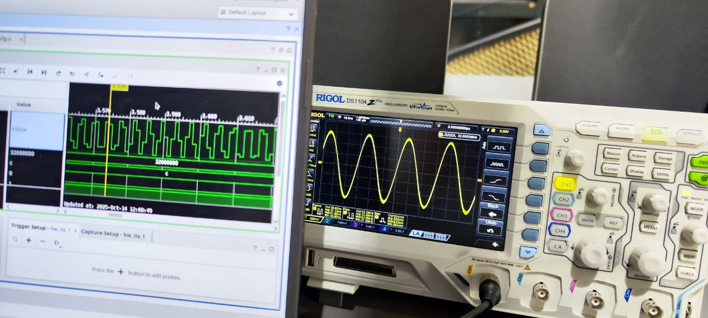

# FPGA Sine Wave Generator (UART Controlled)

This project implements a UART-controlled sine wave generator on an AMD Xilinx Zynq-7020 FPGA (ALINX development board). 
The system receives frequency and magnitude parameters via UART, generates a sine wave digitally inside the FPGA fabric, 
and outputs it to an external DAC, where the waveform can be observed.

---

## Features

- UART interface for runtime control
- Configurable sine wave:
  - Frequency
  - Magnitude (Amplitude)
- Digital sine generation inside FPGA (DDS/DAG based)
- DAC output interface
- Fully synthesizable RTL design
- Vivado project included

---

## System Architecture

UART RX  →  Control Parser  →  Sine Generator (DDS/DAG)  →  DAC Interface  →  Analog Output

### Main Functional Blocks

### 1. UART Receiver
- Receives frequency and magnitude from host (PC)
- Parses and updates internal configuration registers

### 2. Sine Wave Generator
- Phase accumulator–based architecture
- Frequency controlled by phase increment
- Phase mapped to sine LUT
- Magnitude scaling applied before output

### 3. DAC Interface
- Transfers digital samples to external DAC
- DAC converts digital samples to analog sine waveform

---

## Hardware Requirements

- FPGA Board: ALINX Development Board
- FPGA Device: AMD Xilinx XC7Z020 (Zynq-7020)
- External DAC module (compatible with project constraints)
- USB-UART connection for parameter control

---

## How It Works

1. PC sends frequency and magnitude values over UART.
2. FPGA receives and decodes parameters.
3. Phase accumulator updates using:

   phase_next = phase_current + phase_increment

4. Phase is mapped to a sine lookup table (LUT).
5. Output is scaled by magnitude.
6. Digital samples are transmitted to DAC.
7. DAC outputs the analog sine wave.

---

## Frequency Control Formula

If DDS architecture is used:

Fout = (Phase_Increment × Fclk) / 2^N

Where:
- Fclk = system clock frequency
- N = phase accumulator width

---

## Vivado Usage

1. Open Vivado
2. Select "Open Project"
3. Choose the .xpr file
4. Run Synthesis
5. Run Implementation
6. Generate Bitstream
7. Program the FPGA

---

## Experimental Results

### FPGA + DAC Setup

### Sine Wave Example

### Sine Wave at Example

---

## Possible Improvements

- Add phase control
- Add multiple waveform support (square, triangle)
- Replace LUT with CORDIC implementation
- Add AXI interface
- Add PC GUI for parameter control
- Increase waveform resolution

---

Developed for AMD Xilinx Zynq-7020 FPGA platform.
